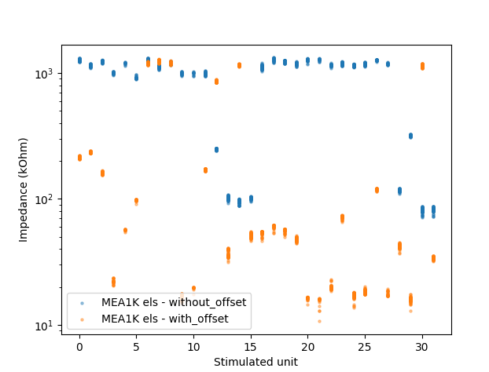

# MEA1K Impedance Analysis and Stimulation Scripts

This repository contains minimal scripts for stimulating MEA1K CMOS devices 
in current mode to infer electrode impedance.

Run with included MaxWell Python installation

## Overview of Main Scripts

### 0. `[not included]`
As a pre step, a collection of configurations is created. Configurations record
from mutiple MEA1K eletrodes below a polyimide interconnect pad (which is routed 
to the polyimide electrode in the brain). One MEA1K electrode below this pad is selected to be stimulated in current mode. Additionally, MEA1K electrodes below interconnect pads
are recorded that connect to neighboring polyimide electrodes in the brain. Each 
of the 1628 interconnect pads is stimulated exactly once to infer the impedance 
of the polyimide electrode in the brain. This is why the configurations are not 
as simple as they could be.

For simpliicty, all of this is omitted, only the final configurations are here.

### 0.1 `char_stim_units.py`
Very simple script to measure stim unit offsets. Interestingly, these measures are
not very consistent. At least after ~3 hours of running stimulation, the outputs
changed. A video (charStimUnit.MOV) of the voltage change across the 1 MOhm 
resistor (1MOhm.png) is in this repo.
The voltage jumps from 0 to 20-30 mV, jumping around abit until it settle on an offset value.

### 1. `main_imped_sine_stim.py`
This script is responsible for configuring and running current mode stimulation on MEA1K. 
It iterates configuration files, routes, creates a sine stimulation sequence in current mode,
and applies it to the one MEA1K electrode connected to a stimulation unit. All of this is
recorded and logged.

This mainly relies on low level maxwell functions in mea1k_config_utils.py

## Usage:
Relevant parameters are in the main() function, specifically with_offset = False or True
If with_offset is True, hardcoded offset values are used for the sine sequence creation.
In meascope, one can see the applied stimulation live. This takes about 2.5h to run.
It can be canclled to analyize partial results.
To run the full pipeline, you need to run this file again.

### 2. `main_analyize_imped.py`
This script iterates over the recorded .raw.h5 files with the stimulated and 
residual MEA1K traces (±1628 .raw.h5 + .csv (metadata) files). It loads the raw
file, converts to uV (using mostly functions from mea1k_raw_preproc.py), and checks 
the voltage amplitude of the sine. This amplitude is saved, and the impedance of
that channels is calulcated (using the assumed current amplidtude (unsure what one 
ADC step means in nA))

## Usage:
Insert the right pathname produced by the first script so that extract_impedance()
see's the list of raw.h5 files. If you run with debug=True, you will see details 
about the traces (very useful) - You can see the DAC values and how the traces 
react.  

This finally creates a new dir in the input dir called processed/ in which 
extracted_imp_voltages.csv is placed. This csv is loaded for visualiation. 
It is actually already part of the repo for two full runs, one with- one without 
offsets. So you can see the final visuzlizations.

Here you should see that MEA1K impedances cluster if they are stimulated by the same StimUnit (see results.png in here)

# Compare with and without offset

You can explore the extracted_imp_voltages.csv  

# Ringnode stimulation method

